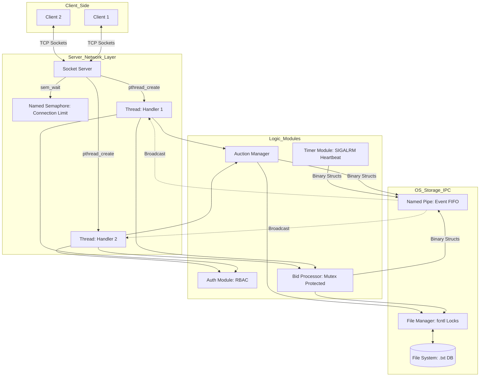
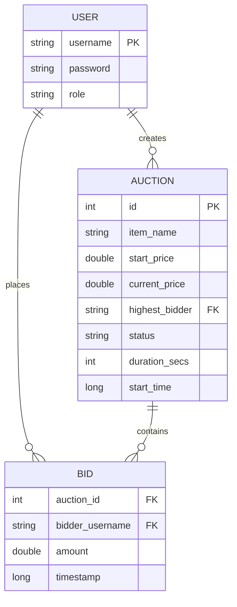

# 🏛️ Concurrent Auction System

> **EGC 301P — Operating Systems Lab Mini Project**  
> A multi-user, real-time auction platform built in C demonstrating all six mandatory OS concepts.

---

## 📋 Table of Contents
1. [Overview](#overview)
2. [System Architecture](#system-architecture)
3. [OS Concepts Implemented](#os-concepts-implemented)
4. [Project Structure](#project-structure)
5. [Build & Run](#build--run)
6. [Command Reference](#command-reference)
7. [Test Results](#test-results)
8. [Design Decisions](#design-decisions)

---

## Overview

The Concurrent Auction System is a TCP-based client-server application where multiple users can simultaneously list, bid on, and close auctions in real time. The project is implemented entirely in **C (C99)** on a POSIX-compliant system and directly demonstrates every mandatory OS concept from the course rubric.

**Key Features:**
- Multi-client TCP server with one dedicated thread per connection
- Role-based access control (Admin / Bidder / Viewer)
- Disk-backed persistence with `fcntl` advisory file locking
- Mutex-protected atomic bid transactions
- Named POSIX semaphore for connection-rate limiting
- Named Pipe (FIFO) for cross-subsystem IPC event broadcasting
- SIGALRM-driven auction countdown timers with SIGINT graceful shutdown

---

## 🏗️ System Architecture

The following diagram illustrates the interaction between the multi-threaded network layer, the logic modules, and the OS-level primitives (IPC, File Locking, Semaphores).



---

## 📊 Data Model (ER Diagram)



---

## 🛠️ Mandatory OS Concepts

### 4.1 Role-Based Authorization — `server/auth.c`

Three roles are defined in `auth.h`:

```c
typedef enum { ROLE_ADMIN, ROLE_BIDDER, ROLE_VIEWER, ROLE_NONE } Role;
```

| Role   | LOGIN | LIST/SEARCH | BID | CREATE | CLOSE |
|--------|-------|-------------|-----|--------|-------|
| ADMIN  | ✓     | ✓           | ✓   | ✓      | ✓     |
| BIDDER | ✓     | ✓           | ✓   | ✗      | ✗     |
| VIEWER | ✓     | ✓           | ✗   | ✗      | ✗     |

Every sensitive operation calls an auth gate before execution:
```c
// bid_processor.c
if (!auth_can_bid(session)) return BID_UNAUTHORIZED;

// socket_server.c
if (!auth_can_create(&session)) {
    sprintf(response, "ERROR: Unauthorized (Admin only)\n");
}
```

User credentials are stored in `data/users.txt` in `username:password:ROLE` format.

---

### 4.2 File Locking — `server/file_manager.c`

Every file read and write uses `fcntl()` POSIX advisory locks:

```c
// Shared lock for reads — allows multiple concurrent readers
apply_lock(fd, F_RDLCK);

// Exclusive lock for writes — blocks all other readers/writers
apply_lock(fd, F_WRLCK);
```

`F_SETLKW` is used (blocking) so threads wait rather than fail. This prevents **lost updates** and **dirty reads** at the filesystem layer. The file manager is the single I/O gateway for all modules.

---

### 4.3 Concurrency Control — `server/bid_processor.c` & `server/socket_server.c`

**Mutex** (in `bid_processor.c`):  
Protects the critical section: Read → Validate → Write, ensuring a bid is atomic:

```c
static pthread_mutex_t bid_mutex = PTHREAD_MUTEX_INITIALIZER;

pthread_mutex_lock(&bid_mutex);
// 1. Read current auction state
// 2. Validate amount > current_price
// 3. Write new bid + update auction file
pthread_mutex_unlock(&bid_mutex);
```

**Named Semaphore** (in `socket_server.c`):  
Limits concurrent connections to 10, demonstrating counting semaphores:

```c
connection_limit = sem_open("/auction_conn_limit", O_CREAT|O_EXCL, 0644, MAX_CONCURRENT_CLIENTS);
sem_wait(connection_limit);   // Block if 10 clients already connected
// ... handle client in new thread ...
sem_post(connection_limit);   // Release slot when client disconnects
```

---

### 4.4 Data Consistency — `server/file_manager.c` + `server/bid_processor.c`

Two layers of consistency protection:

1. **fcntl locks** prevent concurrent file corruption (two processes writing simultaneously)
2. **pthread_mutex** prevents race conditions at the logic level (two threads both winning the same bid)

**Verified by `test_bid_processor`**: 10 threads all bid `100.0` on an auction starting at `50.0` simultaneously. Only **exactly 1** thread succeeds; all others get `OUTBID`.

**Verified by `test_file_manager`**: 5 forked processes each append 100 lines. Final line count is always **500/500** — no corruption.

---

### 4.5 Socket Programming — `server/socket_server.c` + `client/client.c`

Full TCP client-server model using Berkeley Sockets:

```c
// Server side
server_fd = socket(AF_INET, SOCK_STREAM, 0);
bind(server_fd, &address, sizeof(address));
listen(server_fd, 3);
new_socket = accept(server_fd, &address, &addrlen);
pthread_create(&thread_id, NULL, client_handler, new_sock);

// Client side
sock = socket(AF_INET, SOCK_STREAM, 0);
connect(sock, &serv_addr, sizeof(serv_addr));
send(sock, buffer, strlen(buffer), 0);
recv(sock, response, BUFFER_SIZE, 0);
```

The server spawns a **dedicated pthread** per client, maintaining independent authentication sessions and enabling true concurrency.

---

### 4.6 Inter-Process Communication — `server/ipc.c`

A **Named Pipe (FIFO)** at `data/auction_events.fifo` acts as an event bus. When any module raises an event (bid placed, auction created/closed), it writes a binary `AuctionEvent` struct to the FIFO:

```c
// Any module: raises an event
AuctionEvent ev = { .type = EVENT_BID_PLACED, .auction_id = id, ... };
ipc_send_event(ev);   // writes to FIFO

// Background listener thread reads from FIFO
void *ipc_listener_worker(void *arg) {
    while (running) {
        int fd = open(FIFO_PATH, O_RDONLY);
        while (read(fd, &event, sizeof(AuctionEvent)) > 0)
            listener_callback(event);   // broadcasts to all clients
    }
}
```

**Additionally, Signals (IPC mechanism)**:
- `SIGALRM`: Raised every second by `timer.c` to drive auction expiry checks
- `SIGINT`: Trapped in `main.c` for graceful server shutdown + client notification

---

## Project Structure

```
auction_system/
├── Makefile                   # Build system (all, setup, run, tests, test-run)
├── README.md                  # This file
├── .gitignore
├── data/
│   ├── users.txt              # User database (admin/bidder/viewer accounts)
│   ├── auctions/              # Auction records — one .txt file per auction
│   └── bids/                  # Bid logs — one .txt file per auction
├── client/
│   └── client.c              # Interactive CLI client (colored ANSI output)
└── server/
    ├── main.c                 # Entry point, signal handlers, module bootstrap
    ├── auth.h / auth.c        # RBAC — session, roles, permission gates
    ├── file_manager.h / .c    # fcntl advisory R/W locking, all file I/O
    ├── auction_manager.h / .c # Auction CRUD with disk serialization
    ├── bid_processor.h / .c   # Mutex-protected atomic bid transactions
    ├── timer.h / .c           # SIGALRM-based countdown timers
    ├── ipc.h / ipc.c          # Named FIFO event bus + listener thread
    ├── socket_server.h / .c   # TCP server, semaphore, per-client threads
    ├── test_auth.c            # Auth unit test
    ├── test_file_manager.c    # File lock concurrency test (fork-based)
    ├── test_auction_manager.c # Auction CRUD test
    ├── test_bid_processor.c   # Bid concurrency test (pthread-based)
    ├── test_ipc.c             # Named pipe IPC test (fork-based)
    └── test_timer.c           # Timer expiry + signal test
```

---

## Build & Run

### Prerequisites
- GCC (C99)
- POSIX-compliant OS (Linux or macOS)

### Build
```bash
cd auction_system
make all          # Compiles auction_server and auction_client
make setup        # Creates data directories and seeds users.txt
```

### Run
**Terminal 1 — Start the server:**
```bash
./auction_server
```

**Terminal 2 — Connect as Admin:**
```bash
./auction_client
auction> LOGIN admin admin123
auction> CREATE MacBook 80000 120
auction> LIST
auction> CLOSE 1
```

**Terminal 3 — Connect as Bidder:**
```bash
./auction_client
auction> LOGIN alice alice123
auction> LIST
auction> SEARCH MacBook
auction> BID 1 85000
auction> HISTORY 1
```

### Run All Tests
```bash
make test-run     # Builds and runs all 6 module tests sequentially
```

---

## Command Reference

| Command | Requires Role | Description | Example |
|---------|---------------|-------------|---------|
| `LOGIN <user> <pass>` | — | Authenticate session | `LOGIN admin admin123` |
| `LIST` | Any | List all auctions | `LIST` |
| `SEARCH <keyword>` | Any | Search by item name | `SEARCH laptop` |
| `CREATE <name> <price> <secs>` | Admin | Create timed auction | `CREATE Laptop 1200 60` |
| `BID <id> <amount>` | Bidder/Admin | Place a bid | `BID 1 1300` |
| `HISTORY <id>` | Any | View bid log | `HISTORY 1` |
| `CLOSE <id>` | Admin | Force-close auction | `CLOSE 1` |
| `HELP` | Any | Show command reference | `HELP` |
| `QUIT` | Any | Disconnect | `QUIT` |

---

## Test Results

All 6 modules tested individually with dedicated concurrent stress tests:

### [1/6] Auth Module Test
```
--- AUCTION SYSTEM AUTH TEST ---

Testing login for user: admin
  ✓ Login successful
  - Can bid: YES
  - Can create: YES
  - Can close: YES

Testing login for user: alice
  ✓ Login successful
  - Can bid: YES
  - Can create: NO
  - Can close: NO

Testing login for user: guest1
  ✓ Login successful
  - Can bid: NO
  - Can create: NO
  - Can close: NO
```

### [2/6] File Manager Concurrency Test
```
--- FILE MANAGER CONCURRENCY TEST ---
Spawning 5 processes, each writing 100 entries...
All processes finished. Verifying results...
Total entries found: 500 (Expected: 500)
✓ SUCCESS: No data corruption detected. Locks enforced order.
```

### [3/6] Auction Manager Test
```
--- AUCTION MANAGER TEST ---

Creating 3 auctions...
Successfully created auctions with IDs: 1, 2, 3

Listing all auctions:
Auction [1]: Vintage Camera  | Price: 50.00  | Status: OPEN
Auction [2]: Gaming Laptop   | Price: 1200.00| Status: OPEN
Auction [3]: Rare Stamp      | Price: 200.00 | Status: OPEN

Closing auction 1...
Auction [1]: Vintage Camera  | Status: CLOSED
```

### [4/6] Bid Processor Concurrency Test
```
--- BID PROCESSOR CONCURRENCY TEST ---

Created auction 1 starting at 50.0
Spawning 10 threads all bidding 100.0 concurrently...
Thread 1  (bidder_1):  SUCCESS
Thread 2  (bidder_2):  OUTBID
Thread 3  (bidder_3):  OUTBID
...
Thread 10 (bidder_10): OUTBID

Final Auction State:
  Price:  100.00
  Winner: bidder_1

Bid History:
<timestamp>|bidder_1|100.00
```

### [5/6] IPC Named-Pipe Test
```
--- IPC named-pipe (FIFO) TEST ---

[WRITER]   Sending 5 events to FIFO...
[WRITER]   Sent event 1
[LISTENER] Received event: CREATED | ID: 101 | User: user_1 | Amount: 10.50
[WRITER]   Sent event 2
[LISTENER] Received event: BID     | ID: 102 | User: user_2 | Amount: 21.00
[WRITER]   Sent event 3
[LISTENER] Received event: CLOSED  | ID: 103 | User: user_3 | Amount: 31.50
[WRITER]   Sent event 4
[LISTENER] Received event: BID     | ID: 104 | User: user_4 | Amount: 42.00
[WRITER]   Sent event 5
[LISTENER] Received event: CREATED | ID: 105 | User: user_5 | Amount: 52.50
[WRITER]   Finished sending. Exiting...

[MAIN] Closing IPC test.
```

### [6/6] Timer + Signal Test
```
--- TIMER MODULE TEST ---

Starting 3 auctions with timers:
- ID 1: 3 seconds
- ID 2: 5 seconds
- ID 3: 7 seconds

T+0s | IDs left: [1: 3s left] [2: 5s left] [3: 7s left]
T+1s | IDs left: [1: 2s left] [2: 4s left] [3: 6s left]
T+2s | IDs left: [1: 1s left] [2: 3s left] [3: 5s left]
[SIGNAL] Heartbeat (SIGALRM)
T+3s | IDs left: [1: 1s left] [2: 3s left] [3: 5s left]
[TIMER] Auction 1 expired! Closing...
T+4s | IDs left: [2: 2s left] [3: 4s left]
[TIMER] Auction 2 expired! Closing...
T+6s | IDs left: [3: 2s left]
[TIMER] Auction 3 expired! Closing...

Test finished. Verifying final states...
Auction 1 status: CLOSED ✓
Auction 2 status: CLOSED ✓
Auction 3 status: CLOSED ✓
```

---

## Design Decisions

| Decision | Rationale |
|----------|-----------|
| **Named Semaphore over `sem_init`** | `sem_init` is deprecated on macOS (POSIX unnamed semaphores not supported on Darwin). `sem_open` is portable and standards-compliant across Linux and macOS. |
| **Mutex + File Lock (two layers)** | Mutex guards the *logic* (read-validate-write sequence); `fcntl` guards the *disk* (concurrent file access from different processes). Both are needed for full correctness. |
| **Named Pipe over Shared Memory** | FIFOs have kernel-managed synchronization and a simple file-like API, ideal for event-log broadcasting. Shared memory requires manual synchronization and is harder to inspect. |
| **Thread-per-Client** | Maintains stateful per-session auth context cleanly. `select`/`poll` would require session state stored externally and complicate the auth model. |
| **`fcntl` over `flock`** | `fcntl` is POSIX standard, supports byte-range locking, and works correctly on NFS-mounted filesystems. `flock` has undefined behavior on some network filesystems. |
| **SIGALRM heartbeat** | Demonstrates signal-based IPC and OS timer interaction. Every second the kernel delivers SIGALRM, which the timer thread uses to check auction expiry — a real-world OS pattern. |

---

## Technologies

| Category | Technology |
|----------|-----------|
| Language | C (C99 Standard) |
| Concurrency | POSIX Threads (`pthreads`) |
| Synchronization | `pthread_mutex_t`, `sem_open` (named semaphore) |
| File Locking | `fcntl()` advisory locks (`F_RDLCK`, `F_WRLCK`) |
| Signals | `SIGALRM`, `SIGINT` via `signal()` / `alarm()` |
| Networking | TCP Sockets (Berkeley Sockets API) |
| IPC | POSIX Named Pipes (FIFOs via `mkfifo`) |
| Build System | GNU Make |
